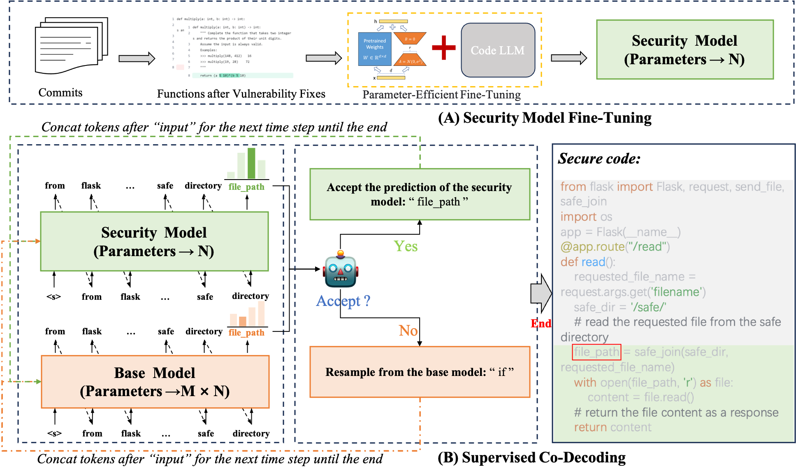

# egd4security_hardening


## ✨Overview



Code for our paper "CoSec: On-the-Fly Security Hardening of Code LLMs via Supervised Co-Decoding"

## Directory Structure

The directory structure of this repository is shown as below:

```
.
|-- data_train_val    # Dataset for training and validation 
|-- data_eval          # Dataset for evaluation
|-- results	            # Experimental results
|-- scripts             # Scripts for training and inference
|-- trained	           # Trained LoRA for security.

```

We used the same training and validation data as [SVEN](https://github.com/eth-sri/sven). 

You can get our security hardening code here

```
.
|-- scripts
   |-- CustomizedGeneration                   # You can get our security hardening code here
```

## 🔨 Setup

```
conda create -n code_sec python==3.10
conda activate code_sec
pip install -r requirements.txt
```

## 🚀 Train

To train a LoRA for security yourself, run:

```
$ python train_lora_sec.py
```

## 🚀 Inference
To generate security-hardened code, run:
```
$ python generate.py
```
To perform security evaluation and functional correctness evaluation, you can simply replace the follow code in SVEN's code with our 'model.generate_with_experts':

```python
class PrefixEvaler(EvalerBase):
    def __init__(self, args):
        super().__init__(args)

    def load_model(self):
        self.tokenizer, self.model, self.input_device = load_model('prefix', self.args.model_dir, False, self.args)
        self.model.eval()

    def sample(self, file_context, func_context, control, lang):
        return self.sample_prefix(file_context, func_context, control, lang)

    def sample_prefix(self, file_context, func_context, control, lang):
        input_src = file_context + func_context
        input_ids = self.tokenizer(input_src, return_tensors='pt').input_ids.to(self.input_device)
        input_ids_len = input_ids.shape[1]
        gen_output = self.model.generate(
            input_ids,
            do_sample=True,
            num_return_sequences=self.args.num_gen,
            temperature=self.args.temp,
            max_new_tokens=self.args.max_gen_len,
            top_p=self.args.top_p,
            pad_token_id=self.tokenizer.pad_token_id,
            use_cache=True,
            control_id=control,
            # return_dict_in_generate=True,
            # output_scores=True,
        )
        return self.process_completions(input_src, input_ids_len, gen_output, lang)

```

in sec_eval.py

and

```python
for i in range(args.num_samples // args.num_samples_per_gen):
    set_seed(args)
    with torch.no_grad():
        samples = model.generate(
            **inputs,
            do_sample=True,
            num_return_sequences=args.num_samples_per_gen,
            temperature=args.temp,
            max_new_tokens=args.max_gen_len,
            top_p=args.top_p,
            pad_token_id=tokenizer.eos_token_id,
            eos_token_id=tokenizer.eos_token_id,
            use_cache=True,
            **kwargs
        )
```

in human_eval_gen.py

**We provide a trained LoRA plugin for Codegen to replicate our experiments.** You can download it from Google Drive: 
https://drive.google.com/file/d/14-ZzUP6XNFo-pwd5mgisJHwfpOvgNNgU/view?usp=drive_link